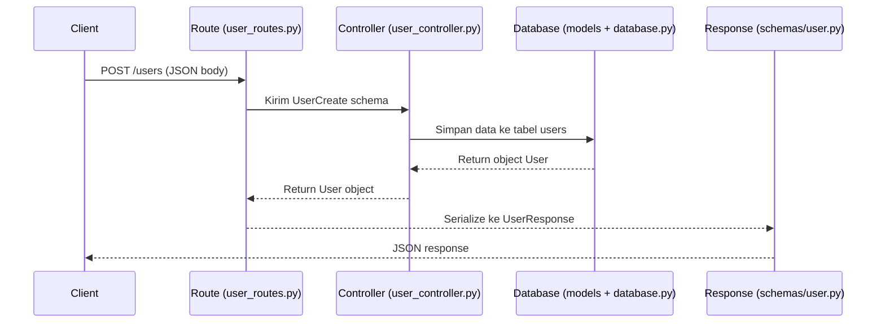
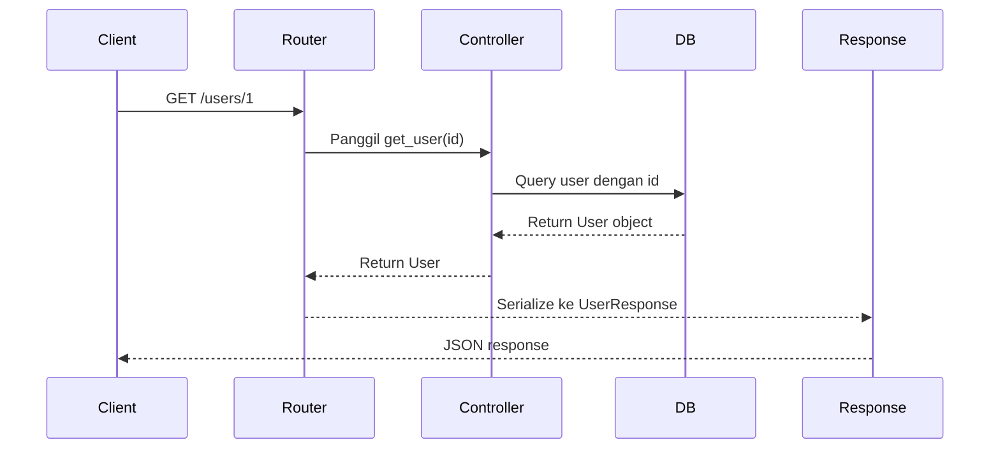
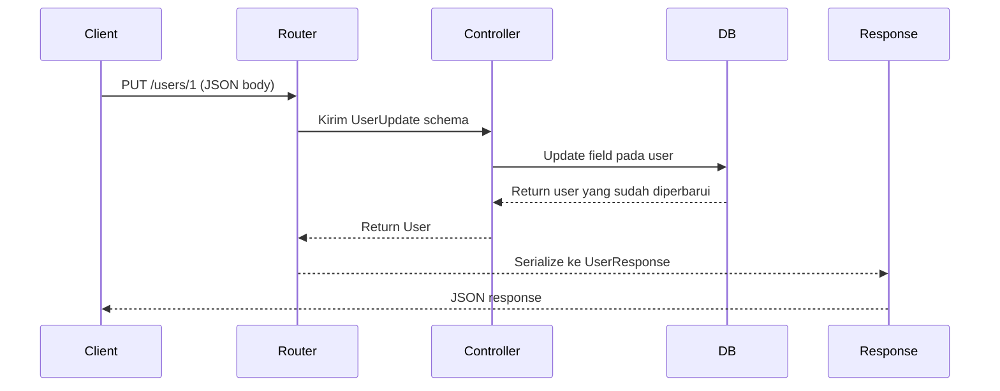
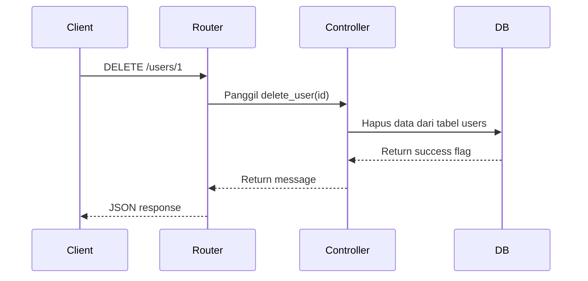

# 📂 Struktur Project

fastapi_app/
│── app/
│   ├── __init__.py
│   ├── main.py                         # Entry point aplikasi
│   ├── core/                           # Konfigurasi inti
│   │   ├── __init__.py
│   │   ├── config.py                   # Settings aplikasi
│   │   ├── database.py                 # Koneksi database
│   │   └── security.py                 # JWT, hashing, dll
│   │   └── constants.py                # Global, reuse constants
│   │
│   ├── api/                            # Endpoints API
│   │   ├── __init__.py
│   │   ├── deps.py                     # Dependencies
│   │   └── v1/
│   │       ├── __init__.py
│   │       ├── api.py                  # Router aggregator
│   │       └── routes/
│   │           ├── __init__.py
│   │           ├── users.py
│   │           ├── auth.py
│   │           └── items.py
│   │
│   ├── models/                         # Database models
│   │   ├── __init__.py
│   │   ├── user.py
│   │   ├── item.py
│   │   └── base.py                     # Base model
│   │
│   ├── schemas/                        # Pydantic models
│   │   ├── __init__.py
│   │   ├── user.py
│   │   ├── item.py
│   │   ├── auth.py
│   │   └── response.py                 # Response schemas
│   │
│   ├── services/                       # Business logic
│   │   ├── __init__.py
│   │   ├── user_service.py
│   │   ├── auth_service.py
│   │   └── item_service.py
│   │
│   ├── middlewares/                    # Custom middleware
│   │   ├── __init__.py
│   │   ├── cors.py
│   │   ├── logging.py
│   │   └── rate_limit.py
│   │
│   └── utils/                          # Utility functions
│       ├── __init__.py
│       ├── validators.py
│       ├── exceptions.py
│       └── helpers.py
│       └── response.py
│
├── tests/                              # Unit tests
│   ├── __init__.py
│   └── conftest.py
│   └── test_users.py
│   └── test_items.py
│
├── alembic/                    # Database migrations
│   ├── versions/
│   └── alembic.ini
│
├── .env                        # Environment variables
├── .env.example
├── .gitignore
├── requirements.txt
├── docker-compose.yml
├── Dockerfile
├── requirements.txt
├── run.py
└── README.md

## 📌 Penjelasan Folder & File

| Path                           | Fungsi                                                                 |
|--------------------------------|------------------------------------------------------------------------|
| `app/main.py`                  | Entry point aplikasi FastAPI, inisialisasi app & load router           |
| `app/core/config.py`           | Konfigurasi global (ENV, DB URL, JWT secret, dll)                      |
| `app/core/database.py`         | Setup database engine & session (`SQLAlchemy`)                         |
| `app/core/security.py`         | Utility keamanan (misal JWT, hashing, auth)                            |
| `app/models/`                  | Definisi __ORM models__ (SQLAlchemy)                                   |
| `app/models/user.py`           | Contoh model `User`                                                    |
| `app/schemas/`                 | Definisi __Pydantic schemas__ untuk validasi/serialisasi               |
| `app/schemas/user.py`          | Schema `UserCreate`, `UserResponse`, dll                               |
| `app/controllers/`             | Business logic / controller (menghubungkan model & route)              |
| `app/controllers/user_controller.py` | Fungsi CRUD untuk user                                           |
| `app/routes/`                  | API endpoints (router per module)                                      |
| `app/routes/user_routes.py`    | Route endpoint `/users`                                                |
| `app/utils/`                   | Helper / fungsi tambahan (misal custom response, formatter)            |
| `app/utils/response.py`        | Utility untuk response standar                                         |
| `tests/`                       | Unit test & integration test                                           |
| `tests/test_user.py`           | Contoh test untuk modul user                                           |
| `.env`                         | File environment (APP_NAME, DB_URL, SECRET, dll)                       |
| `requirements.txt`             | Daftar dependency project                                              |
| `run.py`                       | Script untuk menjalankan `uvicorn`                                     |

---

## 🔄 Alur CRUD

### 1. __Create User__ (POST `/users/`)



#### Request Body (Create User)

```json
{
  "name": "Andi",
  "email": "andi@example.com",
  "password": "secret"
}
```

#### Response (Create User)

```json
{
  "id": 1,
  "name": "Andi",
  "email": "andi@example.com"
}
```

---

### 2. __Read User by ID__ (GET `/users/{id}`)



#### Response (Read User)

```json
{
  "id": 1,
  "name": "Andi",
  "email": "andi@example.com"
}
```

---

### 3. __Update User__ (PUT `/users/{id}`)



#### Request Body

```json
{
  "name": "Andi Updated",
  "email": "andi.updated@example.com"
}
```

#### Response (Update User)

```json
{
  "id": 1,
  "name": "Andi Updated",
  "email": "andi.updated@example.com"
}
```

---

### 4. __Delete User__ (DELETE `/users/{id}`)



#### Response

```json
{
  "message": "User deleted successfully"
}
```

---

## 📌 Contoh Implementasi

### `schemas/user.py`

```python
from pydantic import BaseModel, EmailStr

class UserBase(BaseModel):
    name: str
    email: EmailStr

class UserCreate(UserBase):
    password: str

class UserUpdate(UserBase):
    pass

class UserResponse(UserBase):
    id: int

	model_config = ConfigDict(from_attributes=True)
```

---

### `models/user.py`

```python
from sqlalchemy import Column, Integer, String
from app.core.database import Base

class User(Base):
    __tablename__ = "users"

    id = Column(Integer, primary_key=True, index=True)
    name = Column(String, nullable=False)
    email = Column(String, unique=True, index=True, nullable=False)
    password = Column(String, nullable=False)
```

---

### `controllers/user_controller.py`

```python
from sqlalchemy.orm import Session
from app import models, schemas

def create_user(db: Session, user: schemas.UserCreate):
    new_user = models.User(
        name=user.name,
        email=user.email,
        password=user.password  # biasanya di-hash dulu
    )
    db.add(new_user)
    db.commit()
    db.refresh(new_user)
    return new_user

def get_user(db: Session, user_id: int):
    return db.query(models.User).filter(models.User.id == user_id).first()

def update_user(db: Session, user_id: int, user_update: schemas.UserUpdate):
    user = db.query(models.User).filter(models.User.id == user_id).first()
    if user:
        user.name = user_update.name
        user.email = user_update.email
        db.commit()
        db.refresh(user)
    return user

def delete_user(db: Session, user_id: int):
    user = db.query(models.User).filter(models.User.id == user_id).first()
    if user:
        db.delete(user)
        db.commit()
        return True
    return False
```

---

### `routes/user_routes.py`

```python
from fastapi import APIRouter, Depends, HTTPException
from sqlalchemy.orm import Session
from app.core.database import get_db
from app import schemas, controllers

router = APIRouter(prefix="/users", tags=["Users"])

@router.post("/", response_model=schemas.UserResponse)
def create_user(user: schemas.UserCreate, db: Session = Depends(get_db)):
    return controllers.create_user(db, user)

@router.get("/{user_id}", response_model=schemas.UserResponse)
def read_user(user_id: int, db: Session = Depends(get_db)):
    db_user = controllers.get_user(db, user_id)
    if not db_user:
        raise HTTPException(status_code=404, detail="User not found")
    return db_user

@router.put("/{user_id}", response_model=schemas.UserResponse)
def update_user(user_id: int, user: schemas.UserUpdate, db: Session = Depends(get_db)):
    db_user = controllers.update_user(db, user_id, user)
    if not db_user:
        raise HTTPException(status_code=404, detail="User not found")
    return db_user

@router.delete("/{user_id}")
def delete_user(user_id: int, db: Session = Depends(get_db)):
    success = controllers.delete_user(db, user_id)
    if not success:
        raise HTTPException(status_code=404, detail="User not found")
    return {"message": "User deleted successfully"}
```

---

## 🧪 Unit Test CRUD User

Gunakan __pytest__ untuk menjalankan test:

```bash
pip install pytest httpx
pytest -v
```

### `tests/test_user.py`

```python
import pytest
from fastapi.testclient import TestClient
from app.main import app

client = TestClient(app)

# Dummy data untuk test
user_data = {
    "name": "Test User",
    "email": "test@example.com",
    "password": "password123"
}

updated_user_data = {
    "name": "Updated User",
    "email": "updated@example.com"
}

created_user_id = None

def test_create_user():
    global created_user_id
    response = client.post("/users/", json=user_data)
    assert response.status_code == 200
    data = response.json()
    assert data["name"] == user_data["name"]
    assert data["email"] == user_data["email"]
    created_user_id = data["id"]


def test_read_user():
    response = client.get(f"/users/{created_user_id}")
    assert response.status_code == 200
    data = response.json()
    assert data["id"] == created_user_id
    assert data["email"] == user_data["email"]


def test_update_user():
    response = client.put(f"/users/{created_user_id}", json=updated_user_data)
    assert response.status_code == 200
    data = response.json()
    assert data["name"] == updated_user_data["name"]
    assert data["email"] == updated_user_data["email"]


def test_delete_user():
    response = client.delete(f"/users/{created_user_id}")
    assert response.status_code == 200
    data = response.json()
    assert data["message"] == "User deleted successfully"


def test_read_deleted_user():
    response = client.get(f"/users/{created_user_id}")
    assert response.status_code == 404
    data = response.json()
    assert data["detail"] == "User not found"
```

---

## 📌 Cara Menjalankan Test

1. Pastikan database sudah di-setup dan migrasi tabel `users` sudah dibuat.
2. Jalankan command berikut:

   ```bash
   pytest -v
   ```

3. Hasil test akan menunjukkan status __PASSED/FAILED__ untuk setiap fungsi CRUD.
